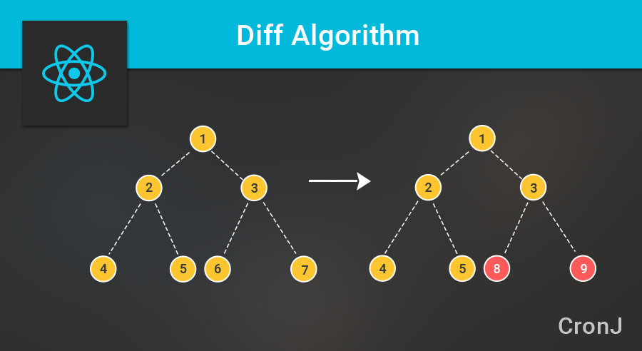

# Chapter 1 리액트 시작

## 리액트의 이해

리액트는 자바스크립트와 달리 사용자 인터페이스를 만드는 데 사용한다. MVC 구조가 아닌 오직 view만 신경쓰는 라이브러리이다.

### 초기 렌더링

리액트에서는 render함수를 통해 초기 렌더링을 한다.  
render 함수는 컴포넌트가 어떻게 생겼는지 정의하는 역할을 한다.
html 자체를 반환하여 DOM에 적용하는 것이 아닌, 뷰가 어떻게 생겼고 어떻게 작동하는지에 대한 정보를 지닌 객체를 반환한다.
 
컴포넌트 내부에는 또 다른 컴포넌트가 들어갈 수 있는데, render 함수 실행 시 내부에 있는 컴포넌트들도 재귀적으로 렌더링한다.
렌더링이 끝난 후 HTML 마크업을 만들고, DOM요소 안에 주입한다.

### 조화과정

리액트는 데이터에 변화가 있을 때 업데이트가 아닌 새로운 요소로 갈아끼운다. 이 과정을 조화 과정이라고 한다.
 
컴포넌트는 업데이트 됐을 때 단순히 업데이트 값을 수정하는 것이 아닌 새로운 데이터를 가지고 render 함수를 다시 호출 한다. 이렇게 다시 만들어진 view를 곧바로 DOM에 적용하는 것이 아닌 <u>이전 render함수로 반환된 객체와 비교 후 최소한의 연산으로 둘의 차이를 알아내 DOM트리를 업데이트 한다</u>.

## Virtual DOM

Virtual DOM은 DOM을 직접 조작하는 대신, 이를 추상화한 자바스크립트 객체를 구성하여 사용한다.
 
리액트에서 데이터가 변할 경우 다음과 같은 절차를 밟는다.

<ol>
    <li>전체 UI를 VirtualDOM에 리렌더링</li>
    <li>이전 Virtual DOM과 내용 비교</li>
    <li>바뀐 부분만 실제 DOM 적용</li>
</ol>

##### DOM TREE 비교 과정

위처럼 6,7번에서 변화가 있을 경우 바뀐 부분만 실제 DOM에 적용한다.
