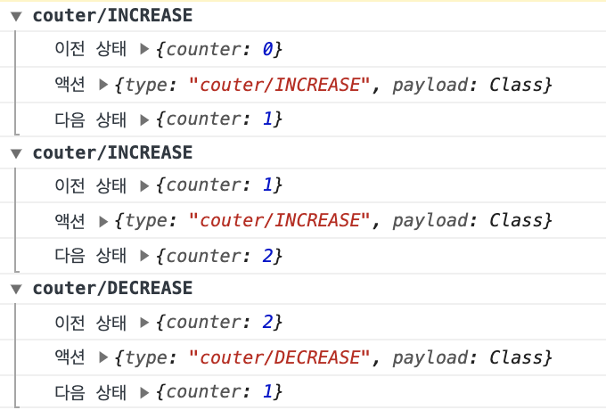
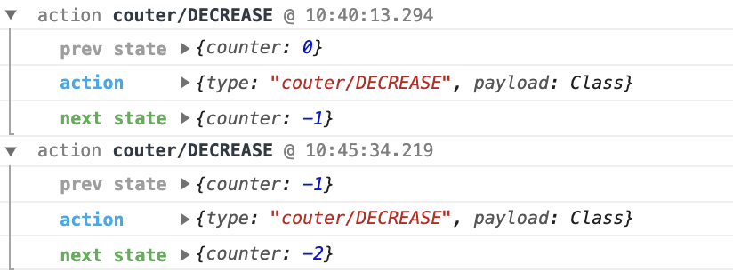

# 리덕스 미들웨어를 통한 비동기 작업 관리

### 미들웨어란?

리덕스 미들웨어는 액션을 디스패치 했을 때 리듀서에서 이를 처리하기 전 실행되는 작업이다.
액션과 리듀서 사이의 중간자라고 볼 수 있다.

```
액션 -> 미들웨어 -> 리듀서 -> 스토어
```

예를 들면 전달받은 액션을 콘솔에 기록하거나, 전달받은 액션 정보를 취소하거나, 다른 종류의 액션을 추가로 디스패치할 수 있다.

## 미들웨어 만들기

실제 프로젝트에서 미들웨어를 직접 만들 일은 많지 않다. 다른 개발자가 만들어 놓은 미들웨어를 사용하면 되기 때문이다. 하지만 어떻게 작동하는지 이해하려면 만들어보는 것이 효과적이기 때문에 간단한 미들웨어를 만들어보도록 하자.

```js
const loggerMiddleware = store => next => action => {
  //미들웨어 기본 구조
};

export default loggerMiddleware;
```

일반적인 미들웨어 구조는 다음과 같은데, 화살표 함수를 연달아 사용한것을 일반 function으로 작성한다면 이렇게 된다.

```js
const loggerMiddleware = function loggerMiddleware(store) {
    return function(next) {
        return (action) {
            // 미들웨어 기본 구조
        }
    }
}
```

미들웨어는 결국 함수를 반환하는 함수를 반환하는 함수이다. 파라미터는 이전 장에서 배운 redux에서 보낸 store, action이다.
반면 생소한 next는 store.dispath와 비슷한 역할을 하는 함수형태의 파라미터이다. 하지만 dispath와 큰 차이점이 있는데, 이는 next(action)을 호출하면 그다음 처리해야 할 미들웨어에게 액션을 넘겨주고, 그다음 미들웨어가 없다면 리듀서에게 액션을 넘겨주는 것이다.

```
액션 -> 미들웨어1 -> next -> 미들웨어2 -> next -> 리듀서 -> 스토어
```

이제 이전 상태, 액션정보, 업데이트된 상태를 보여주는 미들웨어를 구현해보자.

`lib/loggerMiddleware.js`

```js
const loggerMiddleware = store => next => action => {
  console.group(action && action.type); //액션 타입으로 log를 그룹화함
  console.log('이전 상태', store.getState());
  console.log('액션', action);
  next(action); // 다음 미들웨어 혹은 리듀서에게 전달
  console.log('다음 상태', store.getState()); // 업데이트된 상태
  console.groupEnd(); //그룹 끝
};

export default loggerMiddleware;
```

`src/index.js`

```js
import React from 'react';
import {createStore, applyMiddleware} from 'redux';
import rootReducer from './modules';
import loggerMiddleware from './lib/loggerMiddleware.js';
...

const store = createStore(rootReducer, applyMidleware(loggerMiddleware));

ReactDOM.render(...);
```

`결과`



위와 같이 액션 정보와 업데이트 전후의 상태가 나타난다.
미들웨어에서는 여러 종류의 작업을 처리할 수 있다. 특정 조건에 따라 액션을 무시하거나, 액션정보를 가로채서 변경한 후 리듀서에게 전달해 줄 수도 있다.
이런 미들웨어의 특징으로 네트워크 요청과 같은 비동기 작업을 관리하기에 매우 유용하다.

## redux-logger

위에서 만들었던 logger 미들웨어는 이미 잘 만들어진 오픈소스가 있다.

```shell
$ yarn add redux-logger
```

`src/index.js`

```js
import React from 'react';
import {createStore, applyMiddleware} from 'redux';
import rootReducer from './modules';
import {createLogger} from 'redux-logger';
...

const logger = createLogger();
const store = createStore(rootReducer, applyMidleware(logger));

ReactDOM.render(...);
```

`결과`



위처럼 미들웨어는 오픈소스가 많아 라이브러리로 설치해서 사용하는 경우가 많다.
