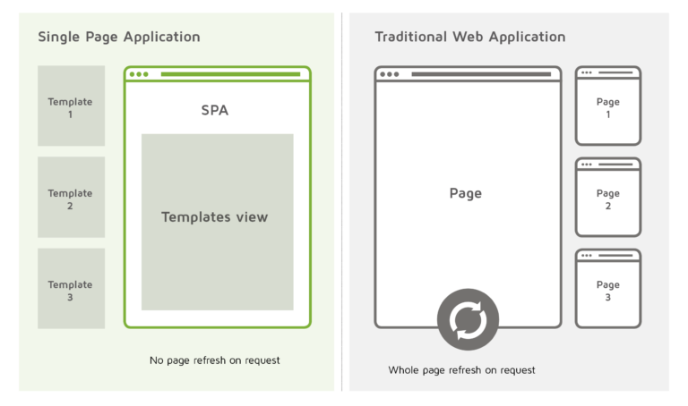

# 리액트 라우터로 SPA 개발하기

### SPA란?

SPA는 Single Page Application의 약어다. 하나의 페이지로 이루어진 애플리케이션이라는 의미다.
 

 
기존 웹 어플리케이션의 경우 오른쪽과 같이 다른 페이지로 이동될 때마다 새로운 html을 받아와 redirect되는 식이다. View를 서버에서 만들어 제공하는 형태인 것이다.
 
 
하지만 SPA는 왼쪽과 같이 하나의 페이지 안에서 인터랙션이 필요한 부분만 자바스크립트를 사용해 업데이트한다. 다른 페이지로 이동 될 경우, 자바스크립트로 새로 렌더링을 하게되고, 필요한 데이터는 서버에 API를 호출하여 필요한 데이터를 Json이나 XML로 불러와 사용한다. 기존 방식과는 다르게 View를 완전히 분리시킨 것이다.

### SPA의 단점

<ol>
    <li>자바스크립트 파일이 너무 커진다.</li>
    <li>SEO(검색엔진최적화)에 좋지 않다.</li>
    <li>첫 페이지 로딩이 길다.</li>
</ol>

##### `위와 같은 문제는 다음과 같은 해결법이 있다.`

<ol>
    <li>코드 스플리팅으로 라우팅별로 파일을 나눈다.</li>
    <li>서버사이드 렌더링 사용</li>
</ol>

### Router

다른 주소에 다른 화면을 보여주는 것을 라우팅이라고 한다.
 
리액트는 View 라이브러리라 기본적으로 이 기능이 내장되어 있지 않다.
 
리액트 라우팅 라이브러리는 리액트 라우터(react-router), 리치 라우터, Next.js등 여러가지가 있다.
